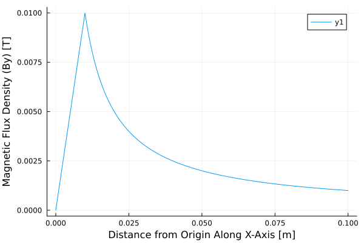

# Wired

A highly optimized Biot-Savart Law integrator, written in Julia.

[](https://github.com/freestatelabs/Wired.jl/actions/workflows/CI.yml?query=branch%3Amain)
[](https://codecov.io/github/freestatelabs/Wired.jl)

Documentation: [https://freestatelabs.github.io/Wired.jl](https://freestatelabs.github.io/Wired.jl)

## Installation

*This library is not currently part of the Julia language.*

Assuming `git` is already installed on your system:

```julia
julia> using Pkg; Pkg.add("github.com/freestatelabs/Wired.jl.git")
julia> using Wired
```

## Basic Usage

Create a Wire of finite length from (x,y,z) = (0,0,0) to (0,0,1000) [m] with 1 kA of current and a finite cross-section radius of 10mm; calculate the magnetic flux density along the x-axis and plot:
```julia
using Plots, Wired

wire = Wire([0,0,0], [0,0,1000], 1000, 0.010);
line = Line([0,0,0], [0.1,0,0], 1000);	# N=1000 points
B = bfield(line.nodes, [wire]);

plot(line.nodes[:,1], B[:,2], label="By")
xlabel!("Distance from Origin Along X-Axis [m]")
ylabel!("Magnetic Flux Density (By) [T]")
```

**Output:**  


## Features
Fast, efficient Biot-Savart Law integration - magnetostatic calculation of magnetic flux density generated by time-invariant currents flowing through filamentized geometries:
* Finite length wires with finite and infinitesimal circular cross-sections
* Circular rings with finite and infinitesimal circular cross-sections
* Load/save functionality
* Use finite element meshes as current-carrying sources
* Calculate Lorentz body-forces on finite element meshes
* Field primitives: lines
* Parallel/multi-threaded processing using Julia's `Threads` module

### In Development
- Parallel processing on GPU using CUDA
- Field primitives: planes
- Further speed improvements using [Polyester.jl](https://github.com/JuliaSIMD/Polyester.jl) and/or [LoopVectorization.jl](https://github.com/JuliaSIMD/LoopVectorization.jl)

## License

See: [License](LICENSE)

MIT. You are free to use this code for any lawful purpose. However, absolutely no warranty of any kind is provided - use at your own risk. The author assumes no liability. 

