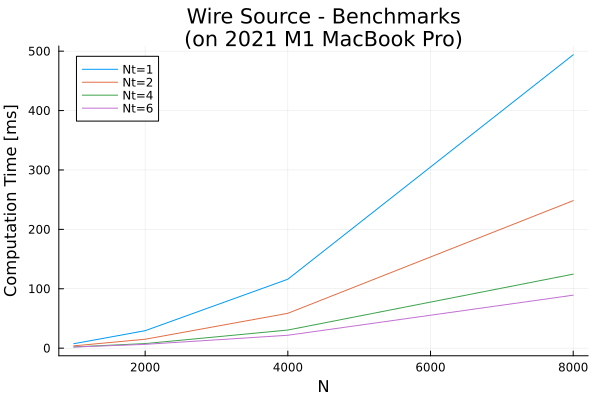

# Benchmarking 

Code benchmarking for Wired.jl (speed tests).  

*All benchmarks performed using a 2021 M1 MacBook Pro (6+2 physical cores, 16GB RAM).*

## Basic Problem
The benchmark problem is simple: determine how fast the program can calculate the Biot Savart Law for different numbers of sources and of node (output) points. 

## `Wire` Sources
Each `Wire` has an effect on each output point, and there are often many sources and many output locations in a problem, so this benchmark assumes equal numbers of sources and output points (`N`). For example, for `N=1000`, there are 1000 source `Wire` objects and 1000 output node locations, for a total of `1000 x 1000 = 1M` computations.

Computational time in milliseconds for different `Wire` problem sizes using various numbers of threads: 

| N | Computations | 1 Thread | 2 Threads | 4 Threads | 6 Threads |
| --- | --- | --- | --- | --- | --- |
| 1000 | 1M | 7.5 | 3.9 | 2.1 | 1.5 | 
| 2000 | 4M | 29.4 | 15.0 | 7.7 | 5.4 | 
| 4000 | 16M | 116.1 | 58.7 | 30.5 | 21.7 | 
| 8000 | 64M | 494 | 248 | 125 | 89.2 |
| 10000 | 100M | 752 | 388 | 200 | 135 |

On this machine, the increase in computation time is roughly proportional to the problem size (N^2), and roughly proportional to the number of threads until Nt=4, when the benefit of using more threads for these problem sizes starts diminishing.  

In other words - the program can run 100 million calculations in 1/8 of a second on a several-generation old consumer laptop. 

## `Ring` Sources

When using the `Ring` object as a source, the scaling follows a similar trend. However, each `Ring` is about 6x more computational expensive than a `Wire` source. This is acceptable, as replacing a `Ring` with `Wire` objects would require many more than 6x `Wire`'s. 

Computational time in milliseconds for different `Ring` problem sizes using various numbers of threads: 

| N | Computations | 1 Thread | 2 Threads | 4 Threads | 6 Threads |
| --- | --- | --- | --- | --- | ---  |
| 1000 | 1M | 41.5 | 21.8 | 10.7 | 7.6  |
| 2000 | 4M | 164.3 | 82.6 | 42.9 | 28.6  |
| 4000 | 16M | 634.9 | 331.9 | 171.5 | 116.1  |
| 8000 | 64M | 2566.3 | 1275.2 | 676.4 | 457.8  |
| 10000 | 100M | 4062.6 | 1978.1 | 1057.8 | 714.1  |

