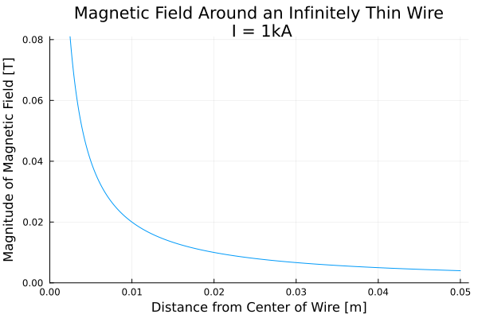

# Theory

Theory manual for Wired.jl

## Basics

### Unit System
All units are MKS:
- Length in `meters`
- Electric current in `amperes`
- Magnetic flux density in `Tesla`

### Coordinate System 
`Wired.jl` uses a global Cartesian coordinate system. It does not currently support 
coordinate system conversions, or cylindrical, spherical, or toroidal systems. 

For current-carrying `Ring` objects, the primary axis of the ring is the `Z` axis.

## The Biot-Savart Law 
The Biot-Savart Law is a fundamental equation of magnetostatics, and analytically 
determines the magnetic field generated by a constant electric current traveling 
along a path in 3D space. Because it is analytical, it can 
be very useful in accurately calculating the effects of complicated arrangements of currents
in 3D space, by breaking down the larger problem into smaller pieces. 

[Wikipedia](https://en.wikipedia.org/wiki/Biot-Savart_law) has a much better 
description than provided here, but the core equation is a line integral:  
```math
 \overrightarrow{B}(r) = \frac{\mu_0}{4\pi} \int_C{\frac{I dl \times r' }{|r'|^3}}
```
* ``r`` is the location in 3D space at which the field is being computed 
* ``\mu_0`` is the magnetic permeability of vacuum - free space (magnetic fields within materials may vary considerably)
* ``I`` is the current flowing along the path 
* ``dl`` is a differential vector along the path 
* ``l`` is a point on the path, such that ``r' = r - l``

For input units in amps [A] and meters [m], the constant ``\mu_0=4\pi \times 10^-7`` [H/m] and ``\overrightarrow{B}`` is in Tesla [T]. 

## Magnetic Field Around a Current-Carrying Wire

### Infinitely Thin Wire 
For the case of an infinitely thin wire, this equation simplies greatly into the 
common scalar form:  

```math
B(r) = \frac{\mu_0 I}{2 \pi r} 
``` 

This equation computes the magnitude of the magnetic field, which is oriented tangent to a circle around the wire axis and perpendicular to the current path. 



Note that the equation has a singularity at radius ``r=0`` and predicts infinite 
magnetic field at the center of the wire. Real conductors have finite cross-section
and do not generate infinite magnetic fields. Also note that the magnetic field
decays very quickly as the observation point moves further away from the current.

For more discussion see the [Hyperphysics Textbook](http://hyperphysics.phy-astr.gsu.edu/hbase/magnetic/magcur.html). 

### Circular Solid Conductor 
Inside a solid conductor, the magnetic field is bounded, and is in fact zero on
the axis. It is also now a function of the  [magnetic permeability](https://en.wikipedia.org/wiki/Permeability_(electromagnetism)), \``\mu\``, of the material
that the current is travelling through. For some materials, like copper, this 
value is close to that of free space, but for others, it can [vary significantly](https://www.engineeringtoolbox.com/permeability-d_1923.html).

```math
B(r) = \frac{\mu I r}{2 \pi R^2}
``` 
  
Outside the conductor, the calculation of the field is exactly the same.


Notice the difference between the graph and the previous: the maximum value of 
the field is on the surface of the conductor and has a finite value. Also, the 
field decays incredibly quickly: just 50mm (2") away from the center of the 
conductor, the field has decayed to less than 1/8 of its maximum value.

### Finite Length Wires
For simple, straight wires in 2D space, the Biot-Savart law is quite straightforward 
and has limited applicability. However, it can be even more useful in determining 
the magnetic fields generated by complex arrangements of current-carrying wires 
by splitting the problem up into many small wires.  

The purpose of `Wired.jl` is to integrate the Biot-Savart law over a large 
number of outpoint points called `nodes`. In this case, the current `sources` are 
discrete wires of a finite length, and an [analytical solution](https://web.mit.edu/6.013_book/www/chapter8/8.2.html) is employed. 


If ``P`` is an arbitrary point in 3D space, and ``\vec{a}`` is a wire segment 
carrying current ``I``, then let ``\vec{b}`` and ``\vec{c}`` be vectors from ``P`` to the 
start and end points of ``\vec{a}``.  Assuming ``P`` is in free space, then the magnetic flux density at ``P`` is given
by: 

```math
\overrightarrow{B} = \frac{I \cdot \mu_{0}}{4 \pi} \cdot \left( \frac{\overrightarrow{a} \cdot \overrightarrow{c}}{|\overrightarrow{c}|} - \frac{\overrightarrow{a} \cdot \overrightarrow{b}}{|\overrightarrow{b}|} \right) \cdot \frac{\overrightarrow{c}\times\overrightarrow{a}}{ {|\overrightarrow{c} \times\overrightarrow{a}|}^2}
```

If there are many current sources and many output locations at which to observe the magnetic field, then this equation can be numerically integrated for all of them. This vector analytical solution corresponds to the infinitely thin wire scalar solution. 

### Current Density Correction 
For node points within the radius of the solid conductor, this equation is multiplied
by the following ratio:
```math
J_{correction} = \frac{{r_o}^2}{{r}^2}
```
where ``r_o = \frac{|\vec{c} \times \vec{a}|}{|a|}`` is the shortest distance from the node to the centerline of the `Wire`, and ``r`` is the finite radius of the `Wire` cross-section.

## Current-Carrying Circular Ring
**Reference**: [Simple Analytic Expressions for the Magnetic Field of a Current-Carrying Loop](https://ntrs.nasa.gov/citations/20010038494)

Similarly, the magnetic field generated by a current traveling in a loop can be expressed analytically. This is especially useful for solenoids such as those in electric motors. The equations are more involved. 

Given a current-carrying ring with finite circular cross-section and the following parameters:
* Height above the `XY` plane ``H``
* Major radius ``R`` 
* Minor radius ``a`` (cross-section radius)
* Electric current ``I`` 

the magnetic flux density at location ``(x,y,z)`` can be calculated.

Intermediate variables:
* `` \rho^2 = x^2 + y^2 ``
* `` r^2 = x^2 + y^2 + z^2 ``
* `` \alpha^2 = R^2 + r^2 - 2 \space R \space \rho ``
* `` \beta^2 = R^2 + r^2 + 2 \space R \space \rho ``
* `` k^2 = 1 - \alpha^2 / \beta^2 ``
* `` C = \mu_0 \space I / \pi `` 

Elliptic integrals:
* Complete elliptic integral of the first kind ``K(k)`` 
* Complete elliptic integral of the second kind ``E(k)`` 

The magnetic flux density components:
```math
\begin{aligned}
\vec{B_x}(x,y,z) = \frac{C \space x \space z}{2\alpha^2 \space \beta \space \rho^2} \left[ \left( \alpha^2 + r^2 \right) \space E(k^2) - \alpha^2 K(k^2) \right] \\
\vec{B_y}(x,y,z) = \frac{y}{x} \space |B_x| \\
\vec{B_z}(x,y,z) = \frac{C}{2\alpha^2 \space \beta} \left[ \left( \alpha^2 - r^2 \right) \space E(k^2) + \alpha^2 K(k^2) \right]
\end{aligned}
```

### Current Density Correction
A similar current density correction is applied to ``(x,y,z)`` locations that fall within the minor radius of the ring:
```math
J_{correction} = \frac{\alpha^2}{a^2}
```
However, note that in this case, the result is an *approximation*. See [Validation](@ref) for more details. 


## Finite Element Meshes

### Converting Mesh to `Wire` Objects


## Other Routines

### Treatment of Numerical Singularities
For certain situations (such as the ``\vec{B_x}`` and ``\vec{B_y}`` components of the magnetic field
at the center of a ring), the analytical solution has a numerical singularity: it diverges to ``\infty``.  

`Wired.jl` converts all singularities to the value of `0.0`.
