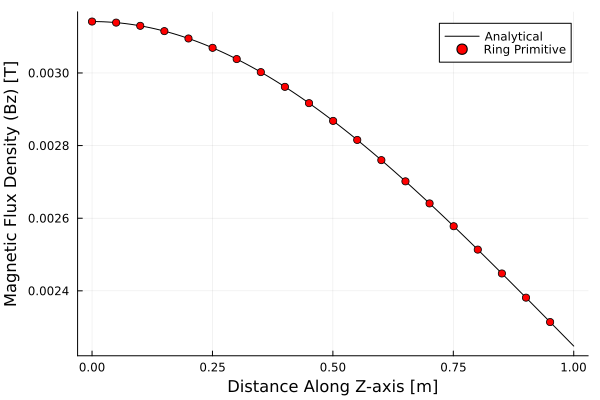

# Validation

Code validation for `Wired.jl`.

## Infinite Wire with Finite Radius

Given an infinite wire along the z-axis with the following parameters:
- `r = 10 mm` (radius of cross-section)
- `I = 1 kA` 

Calculate the y-component of the magnetic field along the x-axis.  The analytical solution is provided by:  
$$B_y(x) = \frac{\mu \space I}{2\pi\space r^2}\cdot x, \space (x<=r)$$
$$B_y(x) = \frac{\mu \space I}{2pi \cdot x}, \space (x > r)$$

### Code
```julia
mu = 1.0; I = 1000; r = 1.0;
wire = Wire([0, 0, -1e4], [0, 0, 1e4], I, r)
line = Line([0,0,0], [2, 0, 0], 100)

By = bfield(line.nodes, [wire])[:,2]
Banalytical = map(x -> (x > r) ? mu0*I/(2pi*x) : mu0*I*x/(2pi*r^2), line.nodes[:,1])

using Plots 
p = plot()
plot!(p, line.nodes[:,1], Banalytical, label="Analytical")
plot!(p, line.nodes[1:5:end,1], By[1:5:end], label="Wire", linealpha=0, markershape=:circle)
xlabel!(p, "Distance Along X-Axis [m]")
ylabel!(p, "Magnetic Flux Density (By) [T]")
```

### Result


## Circular Ring with Finite Radius

Given a circular curent-carrying ring with a circular cross-section and the following parameters:
- `H = 0.0 m`
- `R = 2.0 m`
- `r = 0.1 m` 
- `I = 10 kA`

Calculate the magnetic field at the following locations:
- Along the Z-axis from (0,0,0) to (0,0,1) [m]
- Along the X-axis from (0,0,0) to (0,0,4) [m]

With the following methods
- Analytical (valid only for Z-axis)
- Using a `Wired.CircularRing` primitive 
- Using a finite element mesh

### Code

```julia
H = 0.0 	# height above xy plane
R = 2.0 	# major radius
I = 10e3 	# 10kA current
r = 0.1 	# minor radius (cross-section)

xaxis = Line([0,0,0], [4.0,0,0], 1000)
zaxis = Line([0,0,0], [0,0,1.0], 1000)  

analytical(z) = mu0 * I * (R^2) ./ (2 .* (R^2 .+ z.^2).^1.5)
ring = CircularRing("Ring", H, R, r, I) 

Bz_ring = bfield(zaxis.nodes, [ring])
Bz_analytical = analytical.(zaxis.nodes[:,3])
```

### Result

